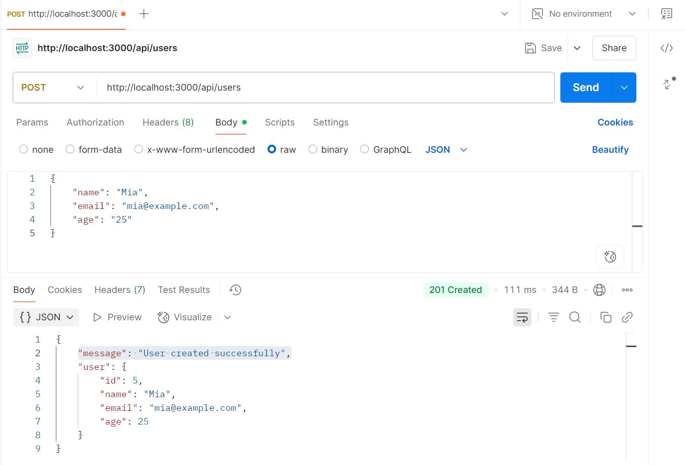
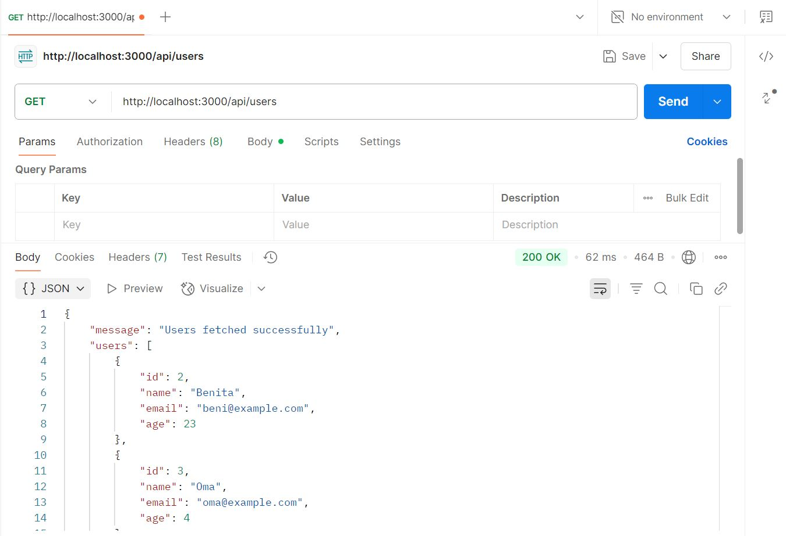
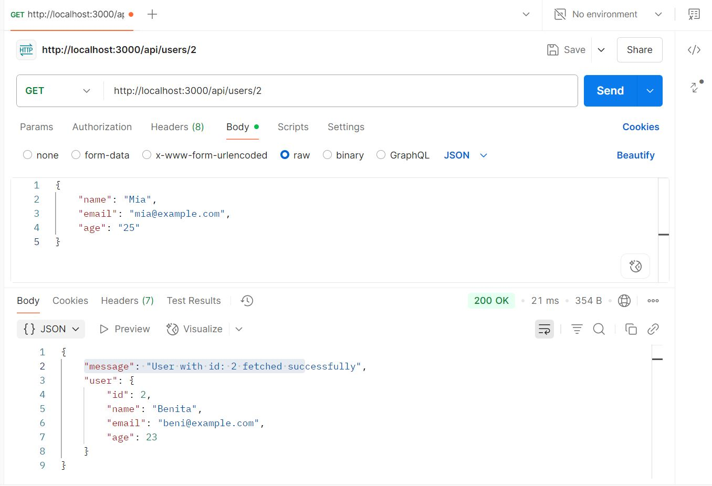
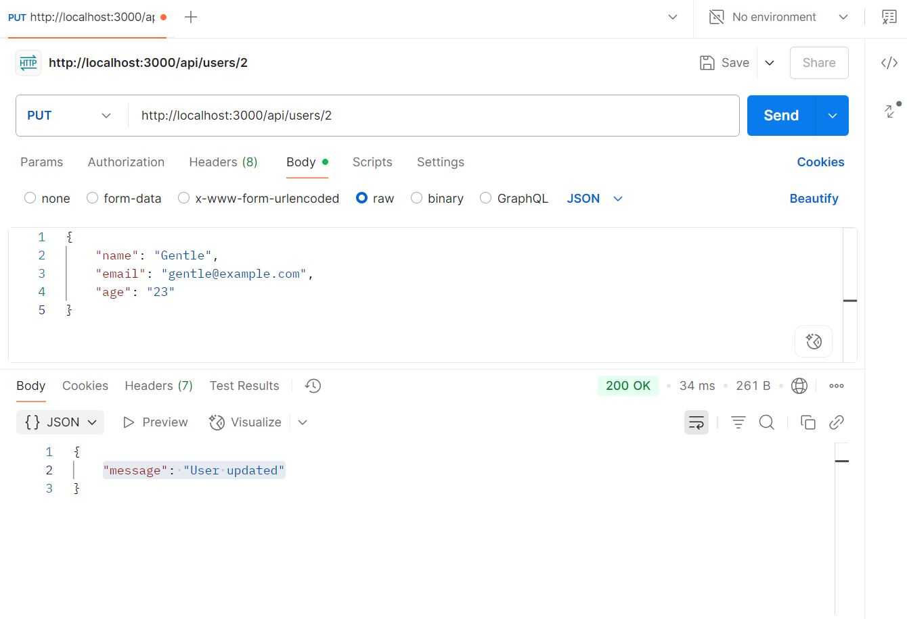
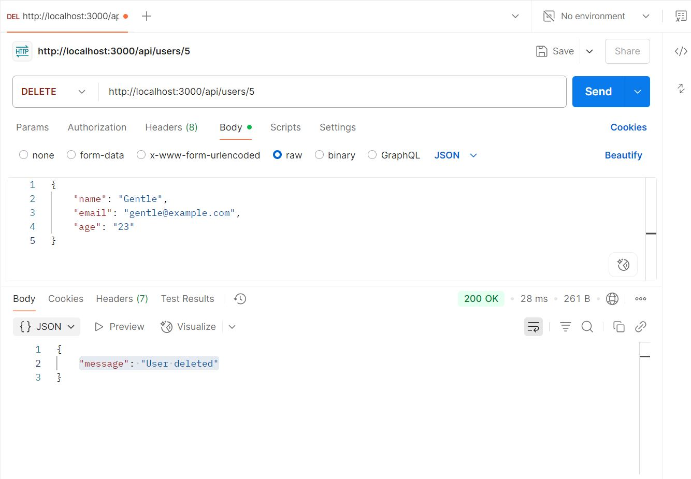

# PostgreSQL CRUD App with Node.js and Express

A simple CRUD (Create, Read, Update, Delete) application using Node.js, Express, and PostgreSQL.

## 🔧 Technologies Used

- Node.js
- Express.js
- PostgreSQL (pg library)
- dotenv (for environment variables)
- Joi (for input validation)
- ESM module (`"type": "module"`)

---

## 🚀 Getting Started

### 1. Clone the Repository

```bash
git clone https://github.com/paschalfidel/node-postgre.git
cd node-postgre
```

### 2. Install Dependencies

```bash
npm install
```

### 3. Create a `.env` file

Add your PostgreSQL database credentials:

```env
DB_PASSWORD=your_password
PORT=3000
```

### 4. Run the Application

#### Development Mode (with nodemon)
```bash
npm run dev
```

#### Production Mode
```bash
npm start
```

Server will run on: `http://localhost:3000`

---

## 🧪 API Endpoints

### Create User

**POST** `/api/users`

```json
{
  "name": "Fidel",
  "email": "fidel@example.com",
  "age": 40
}
```
``` ✅ Success Response
{
  "message": "User created successfully"
}
```
```❌Error Response
{
  "message": "\"email\" must be a valid email"
}
```
📸 **Postman Screenshot for Create User**


---

### Get All Users

**GET** `/api/users`
``` ✅ Success Response 
{
  "message": "Users fetched successfully",
  "users": [
    { "id": 1, "name": "John", "email": "john@example.com", "age": 25 },
    ...
  ]
}
```
``` ❌ Error Response
{
  "message": "Error fetching users"
}
```

📸 **Postman Screenshot for GET all users**


---

### Get User By ID

**GET** `/api/users/:id`

``` ✅ Success Response 
{
  "message": "User with id: 1 fetched successfully",
  "user": { "id": 1, "name": "John", "email": "john@example.com", "age": 25 }
}
```
``` ❌ Error Response
{
  "message": "User not found"
}
```
📸 **Postman Screenshot for GET by ID**


---

### Update User

**PUT** `/api/users/:id`

```json
{
  "name": "Gentle",
  "email": "gentle@example.com",
  "age": 23
}
```
``` ❌ Error Response
{
  "message": "User updated successfully"
}
```
📸 **Postman Screenshot for PUT**


---

### Delete User

**DELETE** `/api/users/:id`

``` ✅ Success Response 
{
  "message": "User with ID: 1 deleted successfully"
}
```
``` ❌ Error Response
{
  "message": "No user found with that ID: 1"
}
```
📸 **Postman Screenshot for DELETE**


---

## 📁 Folder Structure

```
.
├── controllers/
│   └── userController.js
├── db/
│   └── db.js
├── middleware/
│   └── errorHandler.js
├── routes/
│   └── userRoutes.js
├── validations/
│   └── userValidation.js
├── main.js
├── .env
├── .gitignore
└── README.md
```

---

## ✅ Features

- Parameterized SQL queries
- Proper HTTP status codes
- Centralized error handling
- Input validation using Joi
- Modular file structure
- Pagination and filtering for user listing
- Swagger/OpenAPI documentation

---

---

## 🙌 Author

**Paschal Omereife**

---

## 📄 License

This project is licensed under the ISC License.
